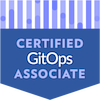
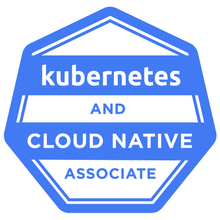
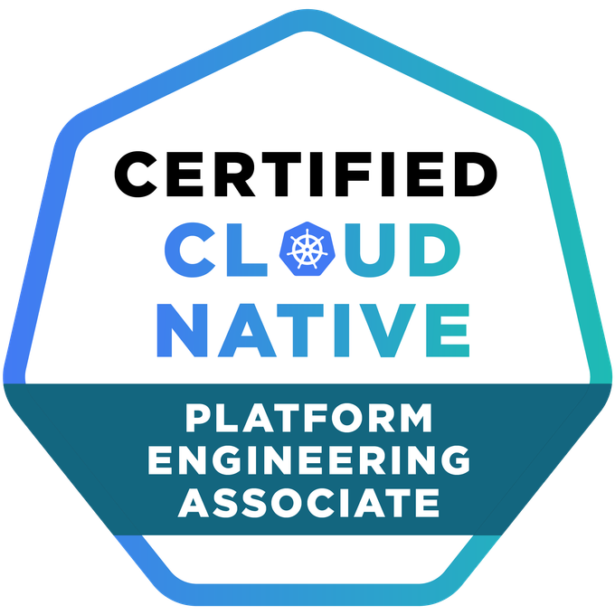
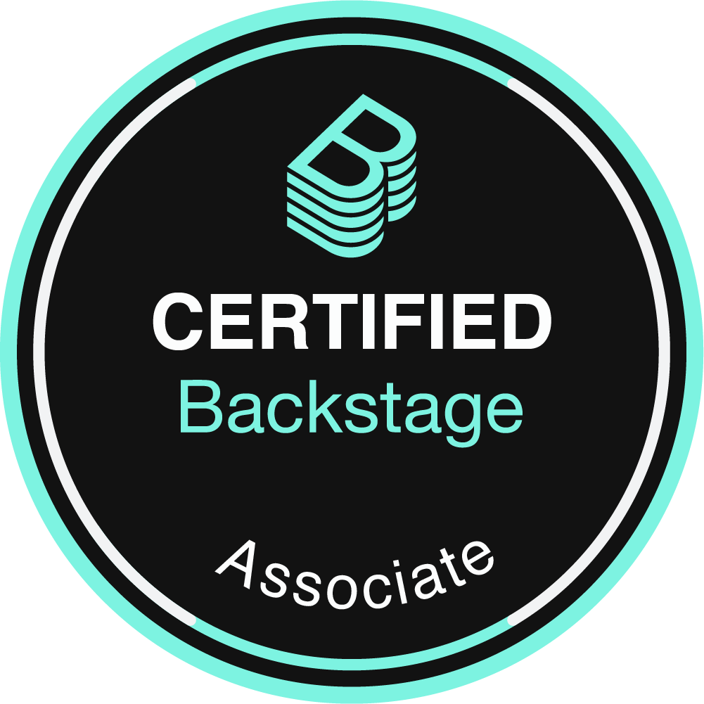

👋 Hi, I'm Moataz Nabil! I’m the book author of [Mobile DevOps Playbook](https://www.amazon.com/Mobile-DevOps-Playbook-accelerating-high-quality/dp/1803242558/ref=sr_1_1?keywords=9781803242552&qid=1680253844&sr=8-1), currently working as Platform and Quality Software Engineering Manager at [Aviv Group](https://www.aviv-group.com/),  previously worked at [Bitrise](https://bitrise.io/), [Delivery Hero SE](https://www.deliveryhero.com/) and [Zalando SE](https://corporate.zalando.com/en) helping mobile engineers to deliver fast, reliable, and secure mobile apps and helping companies to build their developer productivity teams. Bitrise Expert, EX. [AWS Community Builder](https://builder.aws.com/community/@moataz), and Instructor on [TestAutomationU](https://testautomationu.applitools.com/instructors/moataz_nabil.html) and [Udemy](https://www.udemy.com/course/selenium-webdriver-from-foundation-to-framework-in-arabic/?referralCode=070F61E78CBA6A4AD2D3).

Engineering leader focused on building scalable Internal Developer Platforms (IDPs), enhancing developer experience, and empowering high-performing engineering teams. I specialize in platform architecture, GitOps, and FinOps within cloud-native and Kubernetes environments. I bring a strategic mindset to creating platforms that reduce friction, boost productivity, and enable long-term innovation.

I’m driven by the belief that great platforms empower great engineers—and that sustainable, developer-centric solutions are key to lasting success.

## Certifications

  

  
    

## Key Projects 📚
- **[The Internet Automation with Playwright and TypeScript](https://github.com/moatazeldebsy/the-internet-automation-playwright-typescript):** This project is designed to automate the testing of various web functionalities using Playwright in a TypeScript setup. It targets a demo website called The Internet for practicing automation testing.
- **[Mobile DevOps Playbook](https://github.com/moatazeldebsy/Mobile-DevOps-Playbook):** This is the code repository for Mobile DevOps Playbook, published by Packt.
- **[Appium-Server-GitHub-Action](https://github.com/moatazeldebsy/Appium-Server-GitHub-Action):** Running Appium Server with GitHub Action to be able to run Appium mobile test automation scripts.
- **[parallelize-android-UI-Tests-with-Bitrise](https://github.com/moatazeldebsy/parallelize-android-UI-Tests-with-Bitrise):** Demo for Parallelize Android UI Tests with Bitrise, Flank and Firebase Test Lab.
- **[Espresso-TAU](https://github.com/moatazeldebsy/Espresso-TAU):** The demo repository for Espresso course for Test Automation University.
- **[TestCafe-TAU](https://github.com/moatazeldebsy/TestCafe-TAU):** This repo contains the course material for the Test Automation University Course Introduction to E2E Web Testing using TestCafe
- **[Appium-TAU](https://github.com/moatazeldebsy/Appium-TAU):** This repo contains the course material for the Test Automation University Course Mobile Testing using Appium and Java.
- **[sauce-labs-app-automate-action](https://github.com/moatazeldebsy/sauce-labs-app-automate-action):** A GitHub Action for running Espresso Tests for Android using Sauce Labs Runner

## Connect with Me 📬

- [Twitter](https://twitter.com/Moatazeldebsy)
- [LinkedIn](https://www.linkedin.com/in/moataz-nabil/)

I’m looking forward to collaborating on projects that are at the intersection of technology and social good. Let’s connect! 🌍

## Where I publish my content ✍🏻 
- [Youtube Channel](https://www.youtube.com/c/MoatazNabil01) with Arabic videos about test automation and AWS
- [Personal Blog](https://moataznabil.blog/) Where I publish a series of videos, talks, and articles.
- [Bitrise Blog](https://blog.bitrise.io/author/moataz-nabil) The Offical Bitrise blog
- [Test Automation University](https://testautomationu.applitools.com/instructors/moataz_nabil.html) - My free online courses
- [Applitools](https://applitools.com/blog/author/moataznabil/) The Official Applitools blog 
- [Medium](http://moatazeldebsy.medium.com/)
- [Dev.to](https://dev.to/moataznabil)
- [AWS Community](https://community.aws/@moataz)
- [DZone](https://dzone.com/users/3017444/moataznabil.html)

### Blog posts
<!-- BLOG-POST-LIST:START -->
- [Platform Engineering with AWS: What You Need to Know](https://dev.to/aws-builders/platform-engineering-with-aws-what-you-need-to-know-23b8)
- [Optimizing Test Automation at Scale: Important Metrics and Calculating ROI](https://moatazeldebsy.medium.com/optimizing-test-automation-at-scale-important-metrics-and-calculating-roi-553c2ff66edb?source=rss-22507dab7991------2)
- [Elevating Code Quality: The Power of Static Code Analysis in Modern Software Development](https://medium.com/aviv-product-tech-blog/elevating-code-quality-the-power-of-static-code-analysis-in-modern-software-development-e0316e303afb?source=rss-22507dab7991------2)
- [The key responsibilities of a Software Quality Manager: ensuring high-quality software development](https://dev.to/moataznabil/the-key-responsibilities-of-a-software-quality-manager-ensuring-high-quality-software-development-3a9f)
- [Cloud Test Automation on AWS: The Role of QA Engineers](https://dev.to/aws-builders/cloud-test-automation-on-aws-the-role-of-qa-engineers-4j23)
- [Unveiling my first book “Mobile DevOps Playbook”: Your Handbook for Faster, High-Quality Mobile App…](https://moatazeldebsy.medium.com/unveiling-my-first-book-mobile-devops-playbook-your-handbook-for-faster-high-quality-mobile-app-19affc21ebfa?source=rss-22507dab7991------2)
- [Unveiling my first book “Mobile DevOps Playbook” – Your Handbook for Faster, High-Quality Mobile App 📱🚀](https://moataznabil.blog/2023/04/27/unveiling-my-first-book-mobile-devops-playbook-your-handbook-for-faster-high-quality-mobile-app-%f0%9f%93%b1%f0%9f%9a%80/)
- [Unveiling my first book &quot;Mobile DevOps Playbook&quot;: Your Handbook for Faster, High-Quality Mobile App 📱🚀](https://dev.to/moataznabil/unveiling-my-first-book-mobile-devops-playbook-your-handbook-for-faster-high-quality-mobile-app-28m3)
- [2022, Year in Review 🙌🏻](https://moataznabil.blog/2022/12/28/2022-year-in-review-%f0%9f%99%8c%f0%9f%8f%bb/)
- [The Most Beneficial AWS Services for QA Engineers](https://dev.to/aws-builders/the-most-beneficial-aws-services-for-qa-engineers-40f7)
<!-- BLOG-POST-LIST:END -->

### Talks at conferences
Here is a playlist of my talks at various conferences, meetups, and user groups:

https://www.youtube.com/playlist?list=PLTgnULQbEpQDsrNfLGfOTCJ--8ovbmata
