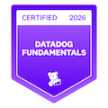
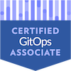
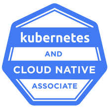
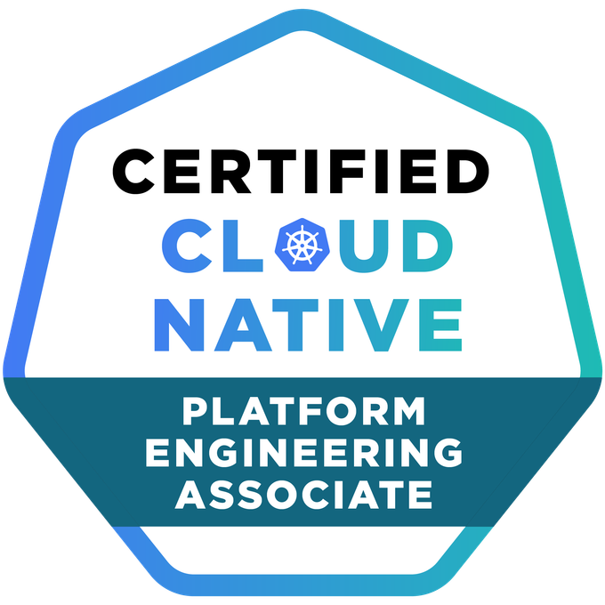
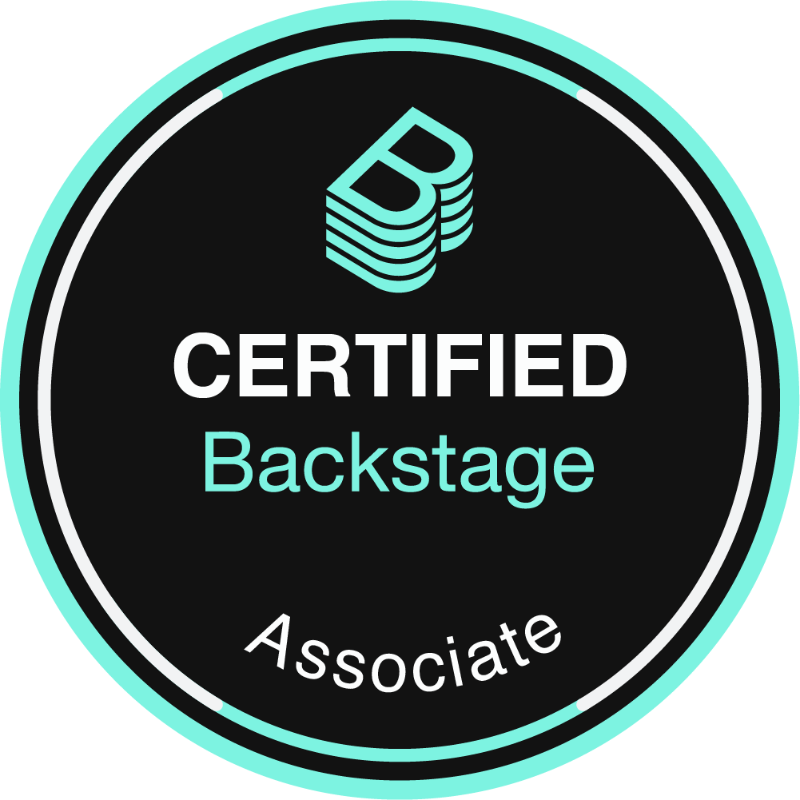
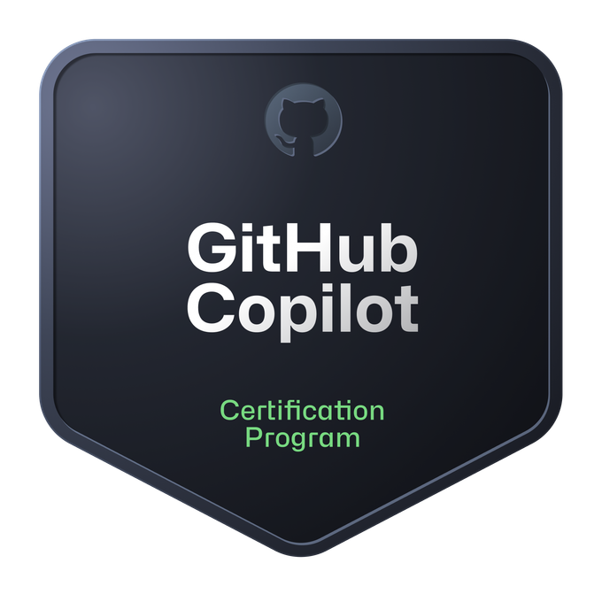
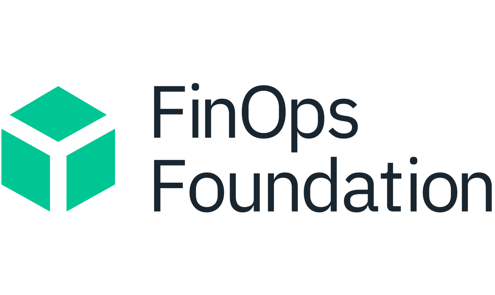

# 👋 Hi, I'm Moataz Nabil

I’m the author of [*Mobile DevOps Playbook*](https://www.amazon.com/Mobile-DevOps-Playbook-accelerating-high-quality/dp/1803242558/ref=sr_1_1?keywords=9781803242552&tag=packtpub-20), an engineering leader, and a technology content creator.

I focus on building scalable **Internal Developer Platforms (IDPs)**, improving developer experience, and empowering high-performing engineering teams. I specialize in platform architecture, DevOps, mobile DevOps, test automation, and cloud technologies.

> Great platforms empower great engineers—and sustainable, developer-centric solutions are key to lasting success.

## 🏅 Certifications

  
  
  
  
  
  
  
  

## 🚀 Featured Projects

- **[Backstage Platform Template](https://github.com/moatazeldebsy/backstage-platform-template)** — A production-ready Internal Developer Platform template featuring Backstage, a golden-path Helm chart, and AI-assisted capabilities.
- **[The Internet Automation with Playwright and TypeScript](https://github.com/moatazeldebsy/the-internet-automation-playwright-typescript)** — Test automation examples using Playwright and TypeScript.
- **[Mobile DevOps Playbook](https://github.com/moatazeldebsy/Mobile-DevOps-Playbook)** — The companion repository for *Mobile DevOps Playbook*, published by Packt.
- **[Appium Server GitHub Action](https://github.com/moatazeldebsy/Appium-Server-GitHub-Action)** — Run an Appium server with GitHub Actions for mobile test automation.
- **[Parallelize Android UI Tests with Bitrise](https://github.com/moatazeldebsy/parallelize-android-UI-Tests-with-Bitrise)** — A demo for parallelizing Android UI tests with Bitrise, Flank, and Firebase Test Lab.
- **[Espresso-TAU](https://github.com/moatazeldebsy/Espresso-TAU)** — Demo repository for the Espresso course on Test Automation University.
- **[TestCafe-TAU](https://github.com/moatazeldebsy/TestCafe-TAU)** — Course material for Test Automation University’s Introduction to E2E Web Testing using TestCafe.
- **[Appium-TAU](https://github.com/moatazeldebsy/Appium-TAU)** — Course material for Test Automation University’s Mobile Testing using Appium and Java.
- **[Sauce Labs App Automate Action](https://github.com/moatazeldebsy/sauce-labs-app-automate-action)** — A GitHub Action for running Android Espresso tests using Sauce Labs Runner.

## ✍️ Where I Publish

- [YouTube](https://www.youtube.com/c/MoatazNabil01) — Arabic videos about test automation and AWS
- [Personal Blog](https://moataznabil.blog/) — Videos, talks, and articles
- [Bitrise Blog](https://blog.bitrise.io/author/moataz-nabil)
- [Test Automation University](https://testautomationu.applitools.com/instructors/moataz_nabil.html) — Free online courses
- [Applitools Blog](https://applitools.com/blog/author/moataznabil/)
- [Medium](http://moatazeldebsy.medium.com/)
- [Dev.to](https://dev.to/moataznabil)
- [AWS Community](https://community.aws/@moataz)
- [DZone](https://dzone.com/users/3017444/moataznabil.html)

## 📝 Recent Blog Posts

<!-- BLOG-POST-LIST:START -->
- [Platform Engineering with AWS: What You Need to Know](https://dev.to/aws-builders/platform-engineering-with-aws-what-you-need-to-know-23b8)
- [Optimizing Test Automation at Scale: Important Metrics and Calculating ROI](https://moatazeldebsy.medium.com/optimizing-test-automation-at-scale-important-metrics-and-calculating-roi-553c2ff66edb?source=rss-22507dab7991------2)
- [Elevating Code Quality: The Power of Static Code Analysis in Modern Software Development](https://medium.com/aviv-product-tech-blog/elevating-code-quality-the-power-of-static-code-analysis-in-modern-software-development-e0316e303afb?source=rss-22507dab7991------2)
- [The key responsibilities of a Software Quality Manager: ensuring high-quality software development](https://dev.to/moataznabil/the-key-responsibilities-of-a-software-quality-manager-ensuring-high-quality-software-development-3a9f)
- [Cloud Test Automation on AWS: The Role of QA Engineers](https://dev.to/aws-builders/cloud-test-automation-on-aws-the-role-of-qa-engineers-4j23)
- [Unveiling my first book “Mobile DevOps Playbook”: Your Handbook for Faster, High-Quality Mobile App…](https://moatazeldebsy.medium.com/unveiling-my-first-book-mobile-devops-playbook-your-handbook-for-faster-high-quality-mobile-app-19affc21ebfa?source=rss-22507dab7991------2)
- [Unveiling my first book &quot;Mobile DevOps Playbook&quot;: Your Handbook for Faster, High-Quality Mobile App 📱🚀](https://dev.to/moataznabil/unveiling-my-first-book-mobile-devops-playbook-your-handbook-for-faster-high-quality-mobile-app-28m3)
- [The Most Beneficial AWS Services for QA Engineers](https://dev.to/aws-builders/the-most-beneficial-aws-services-for-qa-engineers-40f7)
- [Getting started with Appium 2.0: Your beginner’s guide](https://dev.to/moataznabil/getting-started-with-appium-20-your-beginners-guide-3m32)
- [Getting started with Maestro: The new mobile UI testing framework from Mobile.dev](https://dev.to/moataznabil/getting-started-with-maestro-the-new-mobile-ui-testing-framework-from-mobiledev-2n0k)
<!-- BLOG-POST-LIST:END -->

## 🎤 Talks

[Watch my talks at conferences, meetups, and user groups on YouTube](https://www.youtube.com/playlist?list=PLTgnULQbEpQDsrNfLGfOTCJ--8ovbmata).

## 📬 Connect with Me

- [LinkedIn](https://www.linkedin.com/in/moataz-nabil/)
- [Twitter / X](https://twitter.com/Moatazeldebsy)

I’m looking forward to collaborating on projects at the intersection of technology and social good. Let’s connect! 🌍
